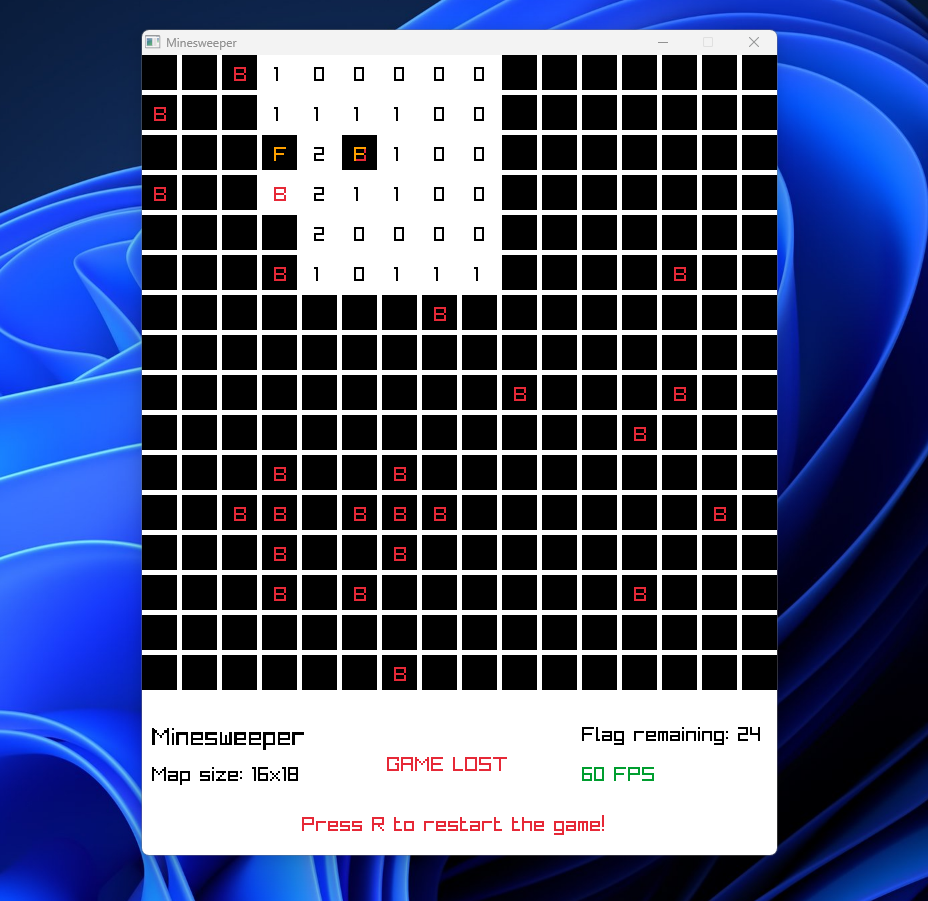

# Minesweeper

Minesweeper is a game made in [Raylib](https://www.raylib.com/) (c++) where you have a grid, it is made of cells, in random cells there can be a bomb, but in the other cells there is a number, this number indicates how many bombs are around it, and you click with mouse  in one cell to discover this number of bombs around it, if you click in a cell where there is a bomb, you loose and the game ends.
You can also flag a cell, in that way if you know that in that cell there is a bomb, you can flag it to avoid to click unintentionally and loose the game, there is a limit of flag you can put, and very often, the number of flag you can put is the same as the number of bombs in the grid.

## Preview

## How is the map created?
The map size is 16x18, where it is created when you start the game, every bomb is randomically positioned.

## How does the cell know where the bomb is?
Each cell has an x and y position on the grid, by subtract one from each and add 1 to each, you get the 8 cells around it, each cell has also a variables that indicates if it contains a bomb, and, by calculating how many cells have bombs in it, you get the number, and with this number, you can find where the bomb is.

## How to run it?
> Just clone the repository and run the **make** command (if you have it).